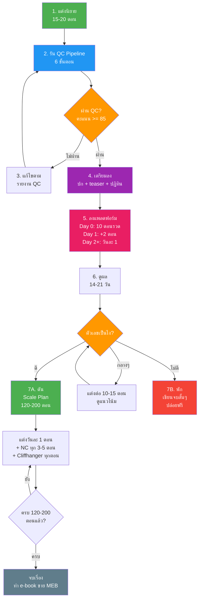
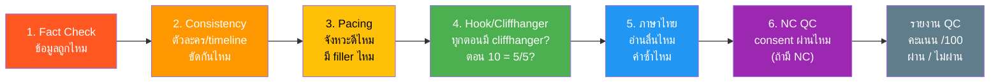
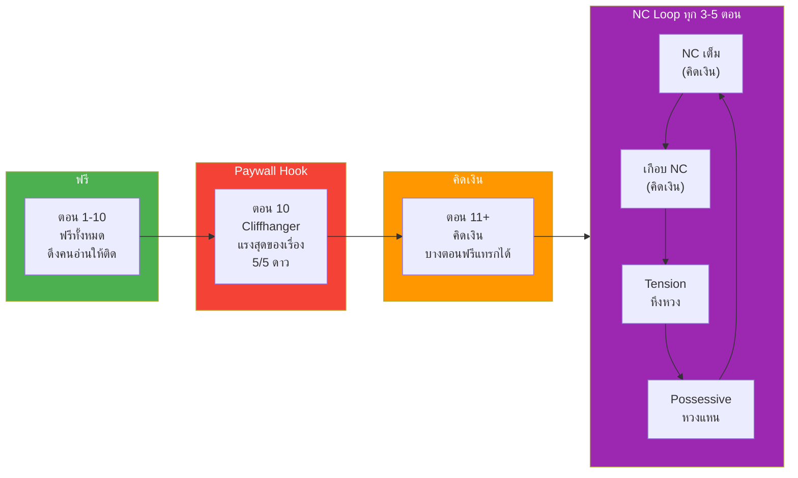
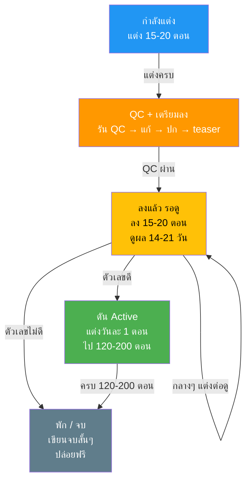
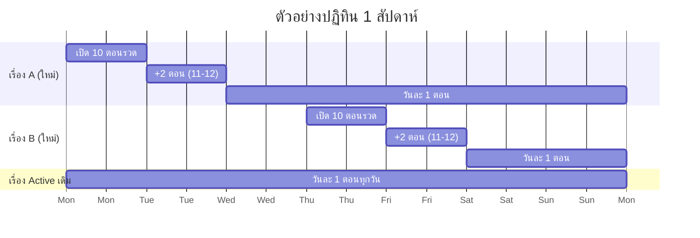

# คู่มือการใช้งาน AI Novel Factory

---

## Flow Diagram: กระบวนการทั้งหมด



### Flow Diagram: QC Pipeline 6 ขั้นตอน



### Flow Diagram: Paywall + NC Loop



### Flow Diagram: Pipeline 4 สถานะ



### Flow Diagram: ปฏิทินปล่อยเรื่อง (ตัวอย่าง 1 สัปดาห์)



---

## ขั้นตอนที่ 1: แต่งนิยาย

ไม่มีอะไรเปลี่ยนจากที่ทำอยู่ แต่งตามปกติ:

```
สร้างนิยายเรื่องใหม่ แนว [มาเฟีย/CEO/ย้อนยุค/etc.]
- สร้างตัวละคร
- วาง plot
- เขียน 15-20 ตอน
```

**เป้าหมาย:** แต่งให้ครบ 15-20 ตอนก่อน ไม่ต้องรีบลง

**ไฟล์ที่ได้:** ตามโครงสร้างเดิมในโฟลเดอร์ novels/ หรือ novels-nc/
- 01-ชื่อเรื่อง.txt
- 02-plot.txt
- 03-ตัวละคร.txt
- 04-เรื่องย่อ.txt
- 05-คำโปรย.txt
- ตอนที่01-[ชื่อตอน].txt ถึง ตอนที่15-20

---

## ขั้นตอนที่ 2: รัน QC Pipeline

เมื่อแต่งครบ 15-20 ตอนแล้ว สั่ง Claude Code:

```
รัน QC Pipeline สำหรับนิยาย [ชื่อเรื่อง]
ตรวจทั้ง 6 ขั้นตอน แล้วสรุปเป็นรายงานตาม ai-factory/templates/qc-report.md
```

### Claude Code จะตรวจ 6 ขั้นตอน:

| ขั้น | ตรวจอะไร | ใช้เวลาประมาณ |
|------|---------|-------------|
| 1. Fact Check | ข้อมูลการแพทย์/กฎหมาย/อาชีพ ถูกไหม | 5-10 นาที |
| 2. Consistency | ตัวละคร/timeline/โลก ขัดกันไหม | 5-10 นาที |
| 3. Pacing | จังหวะดีไหม มี filler ไหม | 5 นาที |
| 4. Hook/Cliffhanger | ทุกตอนมี cliffhanger ไหม ตอน 10 แรงพอไหม | 5 นาที |
| 5. ภาษาไทย | อ่านลื่นไหม คำซ้ำไหม | 5-10 นาที |
| 6. NC QC | consent ผ่านไหม intensity ตรง platform ไหม | 5 นาที (ถ้ามี NC) |

### ผลลัพธ์: รายงาน QC 1 ฉบับ

รายงานจะบอก:
- คะแนนรวม /100
- ผ่าน / ผ่านมีเงื่อนไข / ไม่ผ่าน
- จุดที่ต้องแก้ แบ่งเป็น Critical / Major / Minor
- ข้อเสนอแนะการปรับปรุง

### เกณฑ์ผ่าน QC:
- คะแนนรวม >= 85/100
- ไม่มี Critical issue
- ตอนที่ 10 (paywall hook) ได้คะแนน >= 4/5 ดาว
- NC scenes: consent score >= 8/10 + ไม่มี red flag

### Tips:
- ไม่ต้องรัน 6 ขั้นทีเดียวก็ได้ รันทีละขั้นได้
- รันขั้น 1-4 ก่อน (ตรวจ content) แล้วค่อยขั้น 5 (ขัดภาษา) เพราะถ้าแก้ content จะต้องขัดภาษาใหม่
- NC ตรวจแยกได้ ไม่จำเป็นต้องรันพร้อม QC ปกติ

---

## ขั้นตอนที่ 3: แก้ไขตามรายงาน QC

ดูรายงานแล้วสั่งแก้ทีละจุด:

```
แก้ไข [ชื่อเรื่อง] ตามรายงาน QC:
- ตอนที่ 3: ชื่อตัวละครรองสลับกัน (Critical)
- ตอนที่ 7: จังหวะช้าเกินไป ไม่มี conflict (Major)
- ตอนที่ 10: hook ยังไม่แรงพอ ต้องเป็น 5/5 (Major)
```

ถ้ามี Critical/Major เยอะ แก้แล้วสั่ง QC ซ้ำ:

```
รัน QC Pipeline ซ้ำสำหรับ [ชื่อเรื่อง]
ตรวจเฉพาะตอนที่แก้ไขแล้ว: ตอน 3, 7, 10
```

**วนจนกว่าจะผ่าน** (คะแนน >= 85 + ไม่มี Critical)

---

## ขั้นตอนที่ 4: เตรียมลงแพลตฟอร์ม

เมื่อ QC ผ่านแล้ว ทำ 4 อย่าง:

### 4.1 สร้างปก
```
สร้างปกนิยายสำหรับ [ชื่อเรื่อง] ตาม cover-design-team workflow
```

### 4.2 สร้าง teaser/คำโปรย
```
เขียน teaser สำหรับ [ชื่อเรื่อง] ตาม marketing-team/skills/teaser-writer
```

### 4.3 กำหนดวันลง
ดูปฏิทินใน `ai-factory/publishing-calendar-template.md` แล้วเลือกวัน:
- เลือกวันที่ไม่ชนกับเรื่องอื่นที่เพิ่งเปิด (เว้นอย่างน้อย 2 วัน)
- วันดีๆ: จันทร์, พุธ, พฤหัส, เสาร์

### 4.4 อัปเดต Google Sheet
```
อัปเดต Google Sheet "AI Novel Factory - Pipeline" tab Pipeline
เพิ่มเรื่อง [ชื่อเรื่อง]:
- แนว: [แนว]
- ตอนที่แต่ง: [จำนวน]
- QC Score: [คะแนน]
- แพลตฟอร์ม: Tunwalai
- วันที่ลง: [วันที่]
- สถานะ: QC + เตรียมลง
```

---

## ขั้นตอนที่ 5: ลงแพลตฟอร์ม

### สูตรปล่อยเรื่องใหม่

| วัน | สิ่งที่ทำ | หมายเหตุ |
|-----|---------|---------|
| **Day 0** (วันเปิด) | ลง 10 ตอนรวด | ตอน 1-10 ฟรีทั้งหมด |
| **Day 1** | ลงเพิ่ม 2 ตอน | ตอน 11-12 เริ่มคิดเงิน |
| **Day 2** | ลงเพิ่ม 1-2 ตอน | |
| **Day 3+** | วันละ 1 ตอน | ต่อเนื่องทุกวัน |

### ลง Tunwalai (แพลตฟอร์มหลัก)
1. ลง 10 ตอนรวด
2. ตั้งค่า: ตอน 1-10 ฟรี / ตอน 11+ คิดเงิน / NC คิดเงินทุกตอน
3. ใส่แท็ก/แนว/rating ให้ถูกต้อง
4. ใส่ปก + คำโปรย

### ลง Dek-D (funnel ดึงคน - ถ้าต้องการ)
- ลงฟรี 5-10 ตอน
- ใส่ลิงก์ไป Tunwalai สำหรับตอนต่อ

### อัปเดต Google Sheet
```
อัปเดต Google Sheet "AI Novel Factory - Pipeline"
เรื่อง [ชื่อ] → สถานะ: ลงแล้ว รอดู / วันที่ลง: [วันที่]

อัปเดต tab Calendar ด้วย:
- วันที่ [วันเปิด]: เปิด [ชื่อเรื่อง] 10 ตอน
- วันถัดไป: +2 ตอน
- วันถัดไป: วันละ 1 ตอน
```

---

## ขั้นตอนที่ 6: ดูผล 14-21 วัน

### ทุกสัปดาห์: บันทึกตัวเลข

เข้าดูตัวเลขบน Tunwalai แล้วบันทึก:

```
อัปเดต Google Sheet "AI Novel Factory - Pipeline" tab Pipeline
เรื่อง [ชื่อ]:
- วิว: [จำนวน]
- ผู้ติดตาม: [จำนวน]
- Coin: [จำนวน]
```

### ทุกสัปดาห์: สรุป Weekly Review

```
สรุปสัปดาห์ตาม ai-factory/templates/weekly-review.md
- เรื่องที่เปิดใหม่สัปดาห์นี้
- เรื่อง active ตัวเลขเป็นยังไง
- เรื่องที่ต้องตัดสินใจ
- action items สัปดาห์หน้า
```

### สิ่งที่ดู (ยังไม่มี KPI ตัวเลขตายตัว)
- คนอ่านเพิ่มขึ้นหรือลดลง?
- มีคนติดตามไหม?
- มีคอมเมนต์ไหม? (โดยเฉพาะ "อยากอ่านต่อ", "เมื่อไหร่อัปเดต")
- มีคนเติม coin ซื้อตอนที่ขายไหม?

---

## ขั้นตอนที่ 7: ตัดสินใจ ดัน หรือ พัก

### ถ้าตัวเลขดี → ดัน

**7A.1 ทำ Scale Plan:**
```
ทำ Scale Plan สำหรับ [ชื่อเรื่อง] ตาม ai-factory/templates/scale-plan.md
วางแผน plot 150 ตอน แบ่ง 5 arcs + NC loop ทุก 3-5 ตอน
```

**7A.2 แต่งต่อทุกวัน:**
```
เขียนตอนที่ [XX] ของ [ชื่อเรื่อง] ตาม scale plan
ตอนนี้ต้องมี cliffhanger แรง + [NC/tension/หึงหวง ตาม loop]
```

**7A.3 ลงทุกวัน:**
- วันละ 1 ตอน เวลาเดิม
- ต้อง buffer ล่วงหน้า 10+ ตอน (อย่าให้ stock หมด)

**7A.4 ดันการตลาด:**
```
เขียน LINE broadcast สำหรับ [ชื่อเรื่อง] ตอนที่ [XX]
ตาม marketing-team/skills/line-broadcast-writer
```

**7A.5 QC เป็นระยะ:**
```
รัน QC Pipeline สำหรับ [ชื่อเรื่อง] ตอนที่ [XX-YY]
ตรวจเฉพาะ 10-15 ตอนล่าสุด
```

**7A.6 Cross-post (ถ้าต้องการ):**
หลังลง Tunwalai 7-14 วัน:
- NC เข้มข้น → ลง Fictionlog ด้วย
- BL/GL → ลง ReadAWrite ด้วย

**7A.7 อัปเดต Google Sheet:**
```
อัปเดต Google Sheet "AI Novel Factory - Pipeline"
เรื่อง [ชื่อ] → สถานะ: ดัน (Active)
```

---

### ถ้าตัวเลขไม่ดี → พัก

**7B.1 เขียนจบสั้นๆ:**
```
เขียนจบสั้นๆ 2-3 ตอนสำหรับ [ชื่อเรื่อง]
ให้เรื่องมีจุดจบที่พอรับได้ ไม่ต้องสมบูรณ์แบบ
```

**7B.2 ปล่อยตอนที่เหลือฟรี:**
- ตอนที่ยังไม่ลง + ตอนจบ → ปล่อยฟรีทั้งหมด
- สร้าง goodwill กับผู้อ่าน

**7B.3 บันทึกบทเรียน:**
```
อัปเดต Google Sheet "AI Novel Factory - Pipeline"
เรื่อง [ชื่อ] → สถานะ: พัก
หมายเหตุ: [เหตุผลที่ไม่ขึ้น เช่น hook อ่อน / แนวไม่ตรงตลาด / timing ไม่ดี]
```

**7B.4 เดินหน้าต่อ:**
- ไม่ต้องเสียใจ เอาเวลาไปแต่งเรื่องใหม่
- ใช้บทเรียนจากเรื่องที่พัก ไม่ทำผิดซ้ำ

---

### ถ้าตัวเลขกลางๆ → รอดูต่อ

```
แต่งต่ออีก 10-15 ตอนสำหรับ [ชื่อเรื่อง] ดูแนวโน้ม
```
- ถ้าตัวเลขเพิ่มขึ้น → ดัน
- ถ้าเท่าเดิม/ลดลง → พัก

---

## รวมคำสั่งที่ใช้บ่อย

### การผลิต
| สถานการณ์ | คำสั่ง |
|-----------|-------|
| แต่งเรื่องใหม่ | `สร้างนิยายเรื่องใหม่ แนว [แนว] ชื่อ [ชื่อ]` |
| แต่งตอนต่อ | `เขียนตอนที่ [XX] ของ [ชื่อเรื่อง]` |
| แต่ง NC | `เขียนฉาก NC สำหรับ [ชื่อเรื่อง] ตอนที่ [XX]` |

### QC
| สถานการณ์ | คำสั่ง |
|-----------|-------|
| QC ก่อนลง | `รัน QC Pipeline สำหรับ [ชื่อเรื่อง]` |
| QC ซ้ำหลังแก้ | `รัน QC Pipeline ซ้ำ เฉพาะตอน [XX-YY]` |
| QC เรื่อง active | `รัน QC Pipeline สำหรับ [ชื่อเรื่อง] ตอน [XX-YY]` |
| แก้ตาม QC | `แก้ไข [ชื่อเรื่อง] ตามรายงาน QC: [รายการ]` |

### เตรียมลง
| สถานการณ์ | คำสั่ง |
|-----------|-------|
| สร้างปก | `สร้างปกนิยายสำหรับ [ชื่อเรื่อง]` |
| สร้าง teaser | `เขียน teaser สำหรับ [ชื่อเรื่อง]` |
| สร้าง caption | `เขียน caption social สำหรับ [ชื่อเรื่อง] ตอน [XX]` |
| LINE broadcast | `เขียน LINE broadcast สำหรับ [ชื่อเรื่อง]` |

### ติดตาม
| สถานการณ์ | คำสั่ง |
|-----------|-------|
| อัปเดต sheet | `อัปเดต Google Sheet Pipeline เรื่อง [ชื่อ] สถานะ [สถานะ]` |
| สรุปสัปดาห์ | `สรุปสัปดาห์ตาม weekly-review template` |
| วาง scale plan | `ทำ Scale Plan สำหรับ [ชื่อเรื่อง] [จำนวน] ตอน` |

---

## ตัวอย่างการใช้งานจริง: จากเริ่มต้นถึงทำเงิน

### สัปดาห์ 1: เตรียม stock แรก

สมมติมี "คุณหนูร้อนรักกับนายมาเฟีย" แต่งครบ 20 ตอนแล้ว

1. สั่ง: `รัน QC Pipeline สำหรับ คุณหนูร้อนรักกับนายมาเฟีย`
2. ได้รายงาน: คะแนน 82/100, Major 3 จุด, ตอน 10 hook = 4/5
3. สั่ง: `แก้ไขตาม QC: ตอน 5 timeline ผิด, ตอน 8 จังหวะช้า, ตอน 10 เพิ่มความแรง hook`
4. สั่ง: `รัน QC ซ้ำ ตอน 5, 8, 10` → ผ่าน 88/100
5. สั่ง: `สร้างปก + teaser`
6. กำหนด: ลงจันทร์หน้า

### สัปดาห์ 2: ลงเรื่องแรก + เตรียมเรื่องที่ 2

7. จันทร์: ลง 10 ตอนรวด Tunwalai
8. อังคาร: ลง +2 ตอน
9. พุธ-อาทิตย์: วันละ 1 ตอน
10. ระหว่างนี้: QC เรื่องที่ 2 "สวาทหลังจอ" ไปด้วย
11. อัปเดต Google Sheet

### สัปดาห์ 3: ลงเรื่องที่ 2 + ดูผลเรื่องแรก

12. พฤหัส: ลงเรื่องที่ 2 "สวาทหลังจอ" 10 ตอนรวด
13. ดูตัวเลขเรื่องแรก (Day 14): มีคนติดตาม + เติม coin ดี
14. สั่ง: `สรุปสัปดาห์ตาม weekly-review template`

### สัปดาห์ 4: ตัดสินใจ + เริ่ม scale

15. เรื่องแรก "คุณหนูร้อนรัก" ตัวเลขดี → ตัดสินใจดัน
16. สั่ง: `ทำ Scale Plan สำหรับ คุณหนูร้อนรัก 150 ตอน`
17. เริ่มแต่งต่อวันละ 1 ตอน + NC ทุก 3-5 ตอน
18. ลงทุกวันเวลาเดิม
19. เรื่องที่ 2 รอดูผลต่อ

### เดือน 2-3: สะสมเรื่อง active

20. ทยอยลงเรื่องใหม่สัปดาห์ละ 2
21. เรื่องที่ดี → ดัน / เรื่องที่ไม่ดี → พัก
22. เป้า: สะสม 5-8 เรื่อง active ทำเงินพร้อมกัน

### เดือน 5-6: เข้าเป้า

23. 10-15 เรื่อง active แต่ละเรื่อง 50-80+ ตอนที่ขาย
24. รายได้: 500,000 - 1,000,000 บาท/เดือน

---

## เอกสารที่เกี่ยวข้อง

| เอกสาร | ที่อยู่ | อ่านเมื่อไหร่ |
|--------|-------|-------------|
| คู่มือปฏิบัติการ | `ai-factory/ai-factory-operations.md` | ต้องการดูกลยุทธ์/กฎ |
| QC Pipeline | `ai-factory/qc-pipeline.md` | ต้องการรู้รายละเอียด QC แต่ละขั้น |
| Story Pipeline | `ai-factory/story-pipeline.md` | ต้องการดู 4 สถานะและเกณฑ์ |
| ปฏิทินปล่อย | `ai-factory/publishing-calendar-template.md` | จัดตารางลงเรื่อง |
| กลยุทธ์แพลตฟอร์ม | `ai-factory/platform-strategy.md` | เลือกแพลตฟอร์มลง |
| โมเดลรายได้ | `ai-factory/revenue-model.md` | ดู projection รายได้ |
| Template รายงาน QC | `ai-factory/templates/qc-report.md` | รูปแบบรายงาน QC |
| Template สรุปสัปดาห์ | `ai-factory/templates/weekly-review.md` | สรุปทุกสัปดาห์ |
| Template แผนดัน | `ai-factory/templates/scale-plan.md` | วางแผนเรื่อง hit |
| Google Sheet | AI Novel Factory - Pipeline | track เรื่อง/QC/ปฏิทิน |
